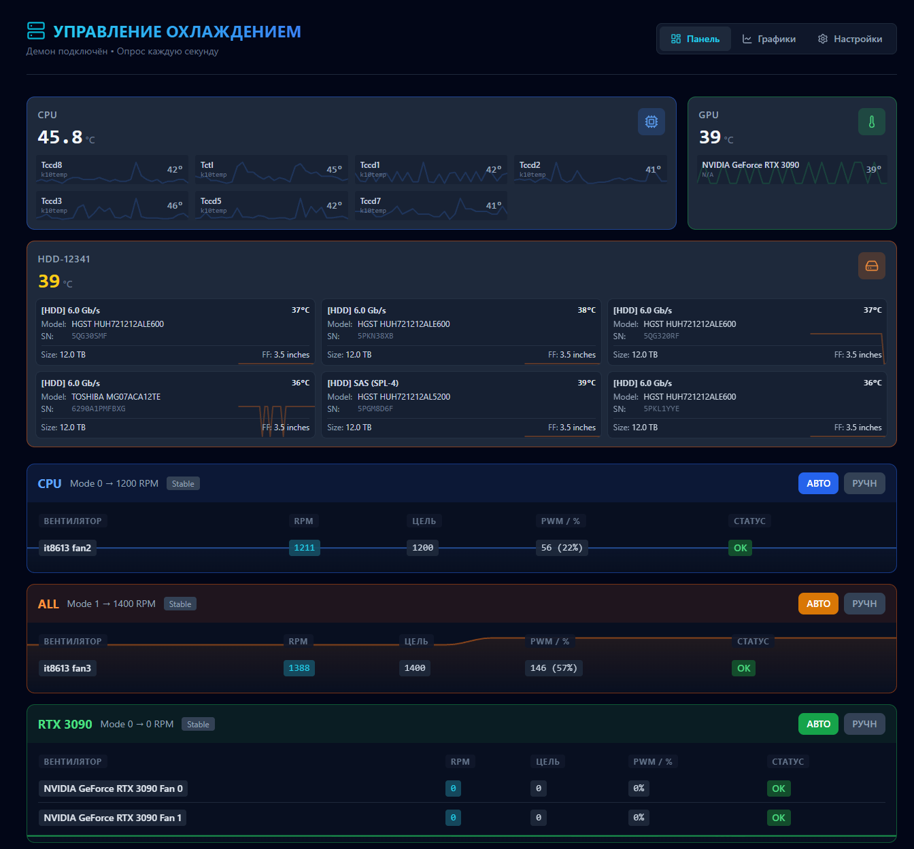
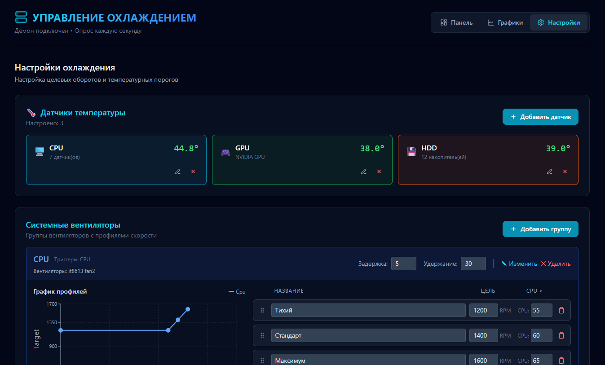
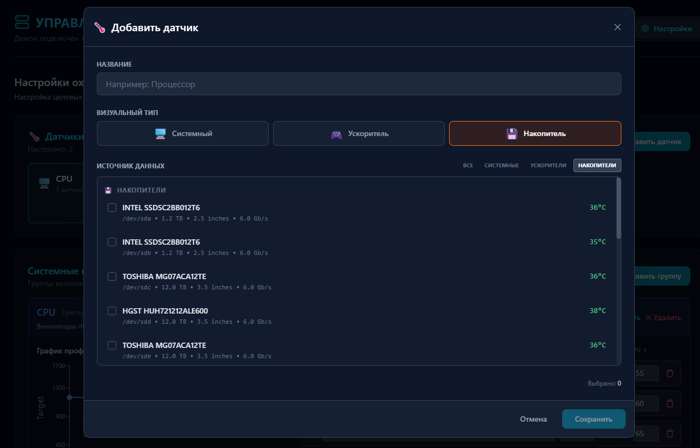
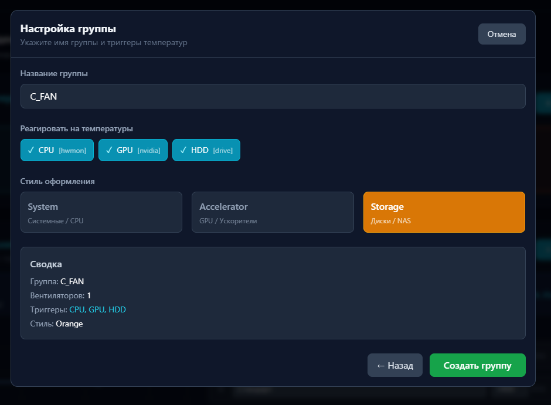
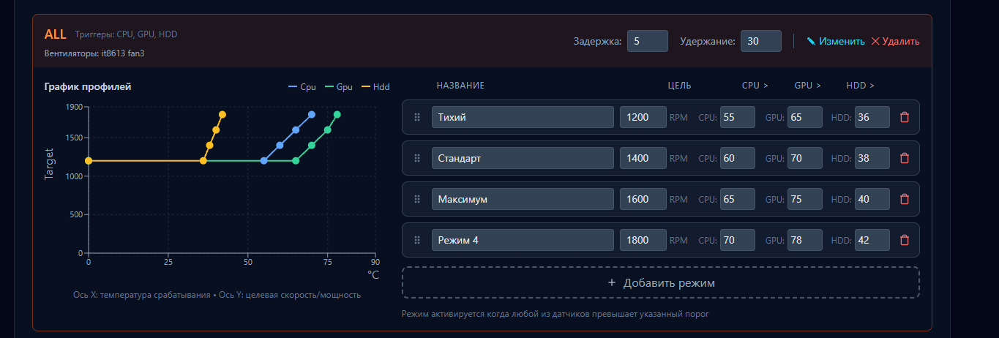
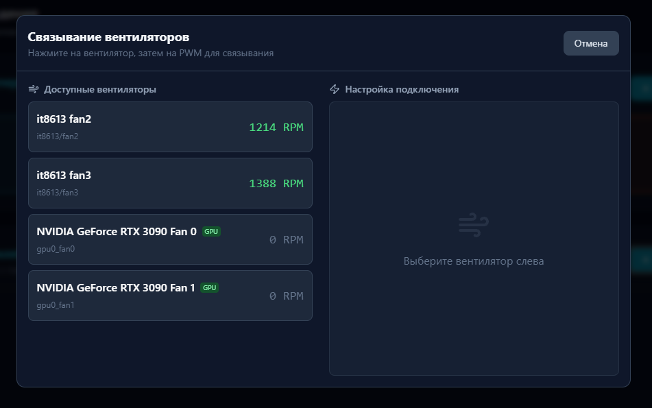
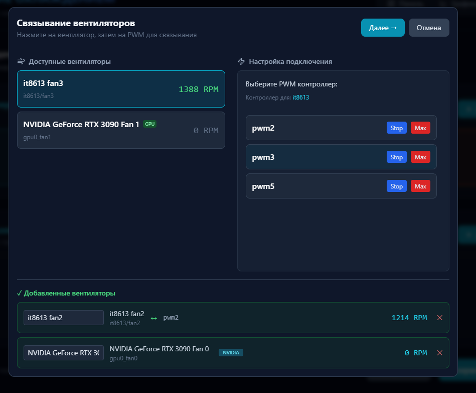

# Proxmox Fan Control System

Автоматическая система управления охлаждением для сервера Proxmox с современным веб-интерфейсом.

## Концепция

Система построена на двух ключевых принципах, обеспечивающих максимальную гибкость:

1. **Универсальные источники данных**: Вы можете добавить **любой датчик** или группу датчиков и использовать их как триггер для **любых групп вентиляторов**. Нет жесткой привязки "CPU кулер только от CPU" — вы сами строите логику.
2. **Целевые обороты (Target RPM)**: Управление осуществляется не через абстрактные проценты мощности (PWM), а через указание **целевых оборотов**. Вы задаете желаемый RPM, а система сама подстраивает напряжение для точного поддержания этой скорости, независимо от модели вентилятора.

## Обзор интерфейса

### Главный экран
Основная панель мониторинга, отображающая состояние всех групп вентиляторов, текущие температуры и обороты.


### Меню настроек
Центральный хаб настроек, позволяющий управлять глобальной конфигурацией, добавлять вентиляторы и датчики.


### Управление датчиками
#### Добавление датчиков
Интерфейс для поиска и добавления новых источников температуры (hwmon, CPU, GPU, HDD).


### Настройка логики охлаждения
#### Группы вентиляторов
Детальная настройка поведения группы: выбор цвета индикации, привязка к датчикам и настройка реакции на изменения температуры.


#### Настройка триггеров
Визуальное редактирование кривых охлаждения и пороговых значений температуры.


### Мастер настройки (Wizard)
#### Сопоставление вентиляторов
Пошаговый процесс определения и привязки физических вентиляторов к логическим группам.



## Особенности

- **Многоуровневая логика**: Автоматическое переключение профилей охлаждения (Silent/Normal/Performance) на основе данных от множества сенсоров.
- **Гибкие кривые**: Визуальный редактор кривых охлаждения с настройкой гистерезиса для предотвращения частого изменения оборотов.
- **Поддержка любого железа**: Работает с **IT87 SuperIO**, **NVIDIA GPU**, **HDD/NVMe** (SMART/System) и любыми стандартными hwmon сенсорами Linux.
- **Современный UI**: Быстрое React-приложение с графиками в реальном времени, поддержкой тем и мобильных устройств.
- **Target RPM (PID)**: Интеллектуальное удержание заданных оборотов (Closed Loop Control) вместо простого задания PWM.
- **Ручной режим**: Возможность принудительного управления любой группой вентиляторов через UI или API.
- **API First**: Полное управление системой через документированный REST API.
- **История и аналитика**: Графики температур и оборотов за различные периоды времени.

## Установка

### 1. Подготовка системы

Установите необходимые системные пакеты и драйверы.

#### Драйвер IT87 (для PWM материнских плат)
Необходим для управления вентиляторами, подключенными к материнской плате (чипы ITE IT87xx/IT86xx).

```bash
# Клонировать драйвер
git clone https://github.com/frankcrawford/it87
cd it87
make && make install

# Если возникает конфликт ACPI:
# Добавить в /etc/default/grub: GRUB_CMDLINE_LINUX="acpi_enforce_resources=lax"
# update-grub && reboot

# Загрузить модуль
modprobe it87 force_id=0x8628 # force_id может потребоваться для некоторых плат
echo "it87" >> /etc/modules
```

#### Headless X Server (для GPU NVIDIA)
Необходим для управления вентиляторами NVIDIA карт (`coolbits`).

```bash
# /etc/systemd/system/headless-x.service
[Unit]
Description=Headless X Server for NVIDIA
After=network.target

[Service]
ExecStart=/usr/bin/Xorg :0 -config /etc/X11/xorg.conf -noreset
Restart=always

[Install]
WantedBy=multi-user.target
```

```bash
# /etc/X11/xorg.conf

# Отключаем авто-поиск устройств ввода (мышь/клавиатура не нужны)
Section "ServerLayout"
    Identifier     "Layout0"
    Option         "AutoAddDevices" "false"
    Option         "AutoEnableDevices" "false"
EndSection

# Основная секция для Nvidia
Section "Device"
    Identifier     "Device0"
    Driver         "nvidia"
    Option         "Coolbits" "4"
    Option         "AllowEmptyInitialConfiguration" "true"
    # BusID "PCI:195:0:0" # Раскомментируйте и укажите, если более 1 GPU (lspci | grep VGA)
EndSection

Section "Screen"
    Identifier     "Screen0"
    Device         "Device0"
    DefaultDepth    24
    SubSection     "Display"
        Depth       24
    EndSubSection
EndSection
```

### 2. Установка приложения

```bash
cd /root
git clone https://github.com/YOUR_USERNAME/fan-control.git monitor
cd monitor

# Установка Python зависимостей (рекомендуется venv)
python3 -m venv .venv
source .venv/bin/activate
pip install -r requirements.txt

# Сборка UI зависимостей
cd fancontrol-ui
npm install
npm run build
cd ..

# Настройка systemd сервиса

```bash
# /etc/systemd/system/fan-control.service
[Unit]
Description=Fan Control Daemon with Web UI
After=network.target headless-x.service
Wants=headless-x.service

[Service]
Type=simple
ExecStart=/usr/bin/python3 /root/monitor/fan_control.py
WorkingDirectory=/root/monitor
Environment="DISPLAY=:0"
Restart=always
RestartSec=5

[Install]
WantedBy=multi-user.target
```

```bash
# Активация сервиса
cp fan-control.service /etc/systemd/system/ # Или создайте файл вручную
systemctl daemon-reload
systemctl enable --now fan-control
```

### 3. Доступ к веб-интерфейсу

Интерфейс доступен по адресу:
`http://<IP-адрес-сервера>:8080`

## API

| Endpoint | Метод | Описание |
|----------|-------|----------|
| `/api/status` | GET | Текущее состояние системы (температуры, вентиляторы) |
| `/api/history?range=1h` | GET | История температур и режимов |
| `/api/config` | GET | Получить полную конфигурацию JSON |
| `/api/config` | POST | Сохранить конфигурацию |
| `/api/override` | POST | Переключить режим (manual/auto) для группы |
| `/api/restart` | POST | Перезапустить сервис |

### Примеры использования

```bash
# Получить статус
curl http://localhost:8080/api/status

# Включить ручной режим (1500 RPM)
curl -X POST http://localhost:8080/api/override \
  -H "Content-Type: application/json" \
  -d '{"groupId": "system", "enabled": true, "mode": "1500"}'
```

## Разработка

Для внесения изменений в UI:

```bash
cd fancontrol-ui
npm install
npm run dev # Запуск vite сервера разработки
```

## Лицензия

MIT

## Автор

Создано для управления охлаждением домашнего сервера на базе Proxmox VE.
