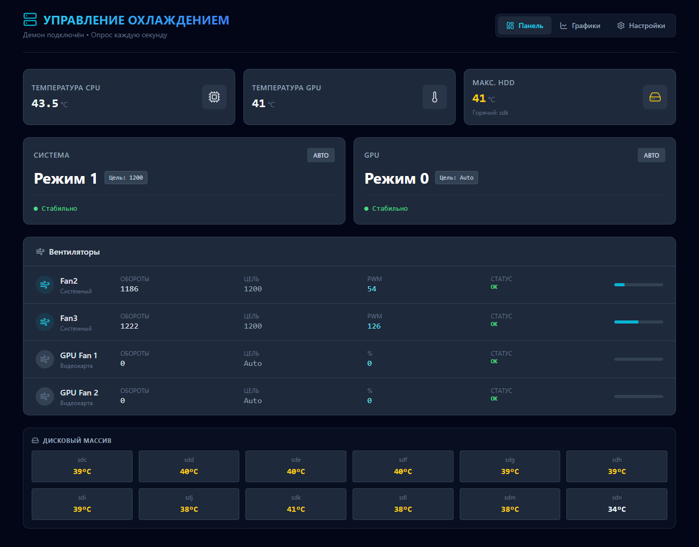

# Fan Control System for Proxmox

Автоматическая система управления охлаждением для сервера Proxmox с веб-интерфейсом.



## Особенности

- **Многоуровневая логика охлаждения** — автоматическое переключение режимов по температуре CPU/GPU/HDD
- **Управление системными вентиляторами** через IT87 SuperIO (PWM)
- **Управление GPU вентиляторами** через NVIDIA Settings
- **Веб-интерфейс** — React-приложение для мониторинга и настройки
- **API** — REST API для интеграции
- **Гистерезис** — защита от частых переключений
- **Ручной режим** — возможность вручную выбрать режим через UI

## Требования

### Железо
- Сервер с SuperIO чипом IT8613E (или совместимый IT87xx)
- NVIDIA GPU (опционально, для управления GPU вентиляторами)
- Proxmox VE или Debian/Ubuntu Linux

### Программное обеспечение
- Python 3.8+
- Node.js 18+ (для сборки UI)
- Драйвер `it87` (out-of-tree версия Frank Crawford)
- `nvidia-settings` (для GPU)

## Структура проекта

```
monitor/
├── fan_control.py          # Основной скрипт Python (демон + HTTP сервер)
├── fan_config.json         # Конфигурация (создаётся автоматически)
├── it87.md                 # Документация по драйверу IT87
├── wiki_article_ru.md      # Статья Wiki (на русском)
└── fancontrol-ui/          # React веб-интерфейс
    ├── App.tsx
    ├── components/
    ├── services/
    └── dist/               # Собранный UI (не в git)
```

## Установка

### 1. Драйвер IT87

```bash
# Клонировать драйвер
git clone https://github.com/frankcrawford/it87
cd it87
make && make install

# Добавить параметр GRUB (если ACPI конфликт)
# /etc/default/grub: GRUB_CMDLINE_LINUX="acpi_enforce_resources=lax"
# update-grub && reboot

# Загрузить модуль
modprobe it87 force_id=0x8628
echo "it87" >> /etc/modules
```

### 2. Headless X Server (для NVIDIA)

```bash
# /etc/systemd/system/headless-x.service
[Unit]
Description=Headless X Server for NVIDIA
After=network.target

[Service]
ExecStart=/usr/bin/Xorg :0 -config /etc/X11/xorg.conf -noreset
Restart=always

[Install]
WantedBy=multi-user.target
```

```bash
# /etc/X11/xorg.conf
Section "Device"
    Identifier "NVIDIA"
    Driver "nvidia"
    Option "Coolbits" "4"
    Option "AllowEmptyInitialConfiguration" "true"
EndSection
```

### 3. Скрипт управления

```bash
cd /root
git clone https://github.com/YOUR_USERNAME/fan-control.git monitor
cd monitor

# Установить зависимости для UI
cd fancontrol-ui
npm install
npm run build
cd ..

# Создать systemd сервис
cp fan-control.service /etc/systemd/system/
systemctl daemon-reload
systemctl enable fan-control
systemctl start fan-control
```

### 4. Доступ к веб-интерфейсу

Откройте `http://YOUR_SERVER_IP:8080`

## API

| Endpoint | Метод | Описание |
|----------|-------|----------|
| `/api/status` | GET | Текущее состояние системы |
| `/api/history?range=1h` | GET | История температур и режимов |
| `/api/config` | GET | Получить конфигурацию |
| `/api/config` | POST | Сохранить конфигурацию |
| `/api/override` | POST | Переключить режим (manual/auto) |
| `/api/restart` | POST | Перезапустить демон |

### Примеры

```bash
# Получить статус
curl http://localhost:8080/api/status

# Включить ручной режим для системы
curl -X POST http://localhost:8080/api/override \
  -H "Content-Type: application/json" \
  -d '{"type":"system","enabled":true,"mode":"2","save":true}'
```

## Конфигурация

Файл `fan_config.json`:

```json
{
  "system": {
    "targets": {"1": 1200, "2": 1600, "3": 2000},
    "thresholds": {
      "2": [57, 76, 41],
      "3": [62, 82, 48]
    }
  },
  "gpu": {
    "targets": {"0": 0, "1": 45, "2": 50, "3": 60, "4": 100},
    "thresholds": {
      "1": [999, 60, 999],
      "2": [999, 70, 999],
      "3": [999, 75, 999],
      "4": [999, 82, 999]
    }
  }
}
```

## Лицензия

MIT

## Автор

Создано для управления охлаждением домашнего сервера на базе Proxmox VE.
